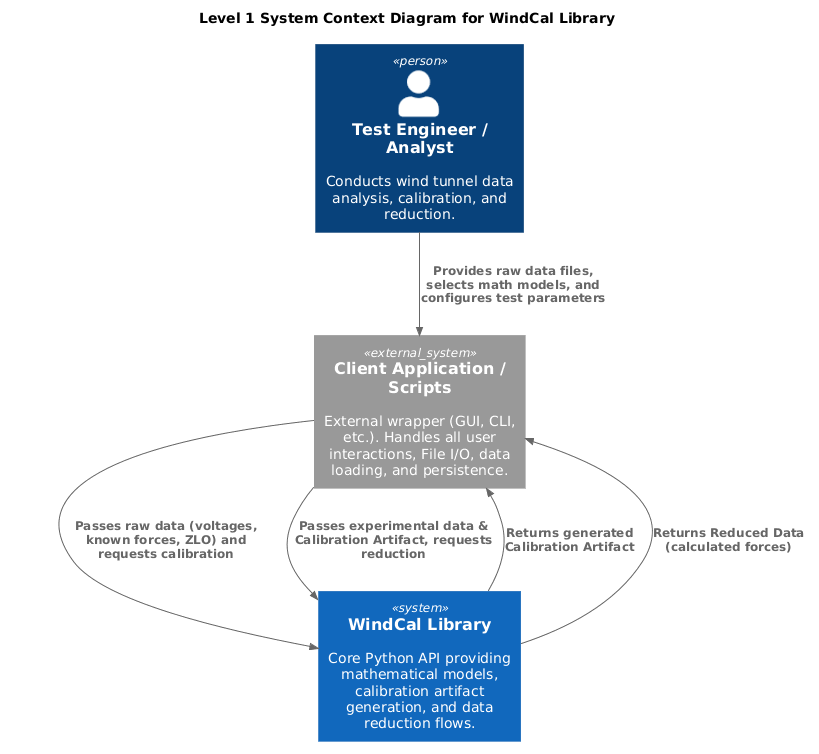
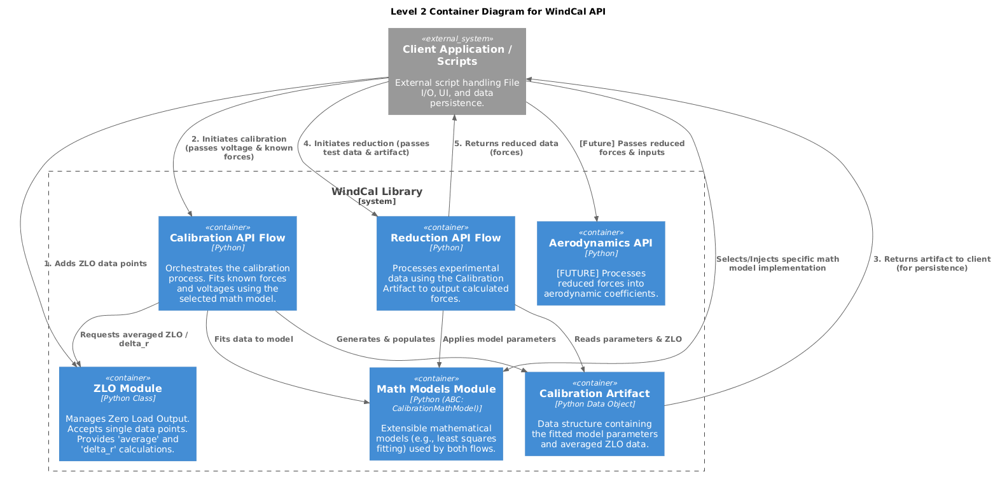

# WindCal Architecture Documentation

## Overview
`WindCal` is a Python library providing a mathematical processing API for wind tunnel data calibration and reduction. It is designed to be decoupled from data ingestion, File I/O, and user interfaces, allowing client applications (such as GUIs, CLIs, or Jupyter Notebooks) to manage state, data parsing, and storage.

## Architectural Principles & Reasoning

### 1. Separation of Concerns (Decoupled UI and File I/O)
The core boundary of `WindCal` is restricted strictly to mathematical operations. File I/O, data parsing, and User Interface (UI) concerns are intentionally kept out of scope to achieve the following benefits:
* **Enhanced Testability & Traceability:** Isolating the mathematical logic allows for rigorous, automated unit testing of the calibration and reduction algorithms. This increases overall trust in the calculated physical data and ensures absolute traceability.
* **Storage and Format Agnostic:** The data storage media and file formats (e.g., CSV, HDF5, databases) can evolve or change entirely without impacting the core processing engine. 
* **Independent UI Evolution:** Multiple client interfaces (such as automated batch-processing CLI scripts, Jupyter Notebooks, or GUI wrappers) can be developed independently without requiring modifications to the underlying math engine.

### 2. Extensible Mathematical Modeling (Strategy Pattern)
By implementing mathematical models via an Abstract Base Class (`CalibrationMathModel`), `WindCal` establishes a strict API contract for how calculations are executed:
* **User Flexibility:** Users can select and inject the most appropriate mathematical model for their specific physical setup or balance characteristics.
* **Safe Extension (Open-Closed Principle):** If an existing model is found to be unsatisfactory, new models can be developed and introduced without compromising or modifying the proven, legacy algorithms already in use.
* **Algorithm Transparency:** Decoupling the orchestration of the calibration flow from the specific math equations makes the codebase highly readable and transparent to peer reviewers.

---

## Level 1: System Context
The Context diagram illustrates `WindCal` as a single, self-contained mathematical engine. It highlights the boundary between the core logic and the external client applications responsible for providing data and handling persistence.

---

## Level 2: API Boundaries (Containers)
The Container diagram breaks down the internal modules of the `WindCal` API. It shows the distinct workflows for Calibration and Reduction, the standalone Zero Load Output (ZLO) processor, and the extensible Math Models based on the `CalibrationMathModel` abstract base class. The `Calibration Artifact` serves as the data bridge between the two primary flows.

---

## Detailed Design (Level 3 - Components)
> **[TODO: Add Level 3 C4 Component Diagrams and class documentation detailing the internal logic for the Calibration flow, Reduction flow, and Math Model implementations.]**
